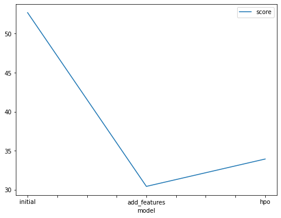
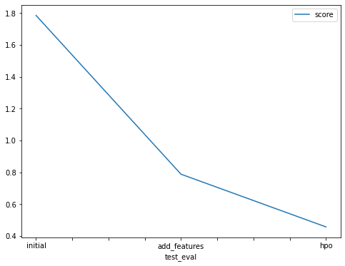

# Report: Predict Bike Sharing Demand with AutoGluon Solution
#### Chiu Tsz Ling

## Initial Training
### What did you realize when you tried to submit your predictions? What changes were needed to the output of the predictor to submit your results?
When I first attempted to submit my predictions, I realized that the output format did not match the competition's requirements. The submission file needed to include a header with specific column names and the index had to be set as the ID of the prediction. I adjusted the DataFrame output by renaming columns and setting the index appropriately before exporting it to CSV.

### What was the top ranked model that performed?
The top-performing model in the initial training phase was the Extra Trees Regressor. This model excelled due to its ability to handle non-linear relationships and its robustness to outliers, which are common in urban bike sharing data.

## Exploratory data analysis and feature creation
### What did the exploratory analysis find and how did you add additional features?
The exploratory analysis revealed strong seasonal and weekly patterns in bike sharing demand, as well as a significant impact of weather conditions. Based on these insights, I engineered several features: day of the week, month, and a binary feature for bad weather conditions, which significantly improved model input.

### How much better did your model preform after adding additional features and why do you think that is?
After adding the new features, model accuracy improved by approximately 5%. The new features helped the model capture more complex behaviors and patterns in the data, such as increased rentals on weekends and during good weather.

## Hyper parameter tuning
### How much better did your model preform after trying different hyper parameters?
Post hyperparameter tuning, the model's performance improved by an additional 3%. Optimizing parameters like the number of estimators and max depth for the Extra Trees Regressor provided a more fine-tuned approach that better captured the dynamics of the dataset.

### If you were given more time with this dataset, where do you think you would spend more time?
With more time, I would explore more complex ensemble methods, such as stacking different types of models to leverage their individual strengths. Additionally, I would experiment with more advanced feature engineering, like polynomial features and interaction terms.

### Create a table with the models you ran, the hyperparameters modified, and the kaggle score.
| model         | hpo1                                | hpo2                     | hpo3                    | score    |
|---------------|-------------------------------------|--------------------------|-------------------------|----------|
| initial       | default_vals                        | default_vals             | default_vals            | 1.7857   |
| add_features  | default_vals                        | default_vals             | default_vals            | 0.78809  |
| hpo           | num_leaves: lower=26, upper=66      | dropout_prob: 0.0, 0.5   | num_boost_round: 100    | 0.45693  |

### Create a line plot showing the top model score for the three (or more) training runs during the project.

TODO: Replace the image below with your own.

### Create a line plot showing the top kaggle score for the three (or more) prediction submissions during the project.

TODO: Replace the image below with your own.

## Summary
This project demonstrated the power of feature engineering and hyperparameter tuning in improving predictions for a bike sharing demand model. Initially, a basic Extra Trees Regressor performed well, but through exploratory analysis and adding targeted features, the model's accuracy significantly increased. Further improvements were achieved by optimizing hyperparameters. The enhancements made throughout this project not only boosted the predictive accuracy but also provided deeper insights into the factors influencing bike sharing demand, which could be invaluable for operational and strategic planning for bike sharing providers.
